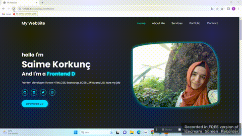

<h3>my-website<h3>

#bu projemde HTML -CSS -JS kullandım

projemin statik ve dinamik kısımları var 

bunları CSS ve JS ile tasarladım

farklı bir CV olabileceği gibi JS öğrenirken güzel bir adım proje olabileceğini düşünüyorum

gif eklendi

